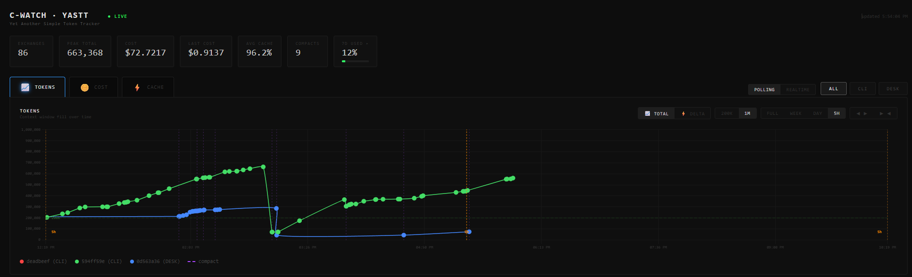

# YASTT — Yet Another Simple Token Tracker

**A local, live dashboard for your Claude Code token usage** — context fill, per‑exchange cost, cache efficiency, sub‑agent breakdown, and your real rate‑limit budget. Runs entirely on your machine.



> ### 🧪 Alpha (`0.2.0-alpha`)
> This is an early release being tested with a small group. It works, but expect rough edges and active updates. Issues and feedback are welcome. See **[Known issues & roadmap](#known-issues--roadmap)**.

---

## What it does

A Node server (`cwatch.js`) serves a single‑page dashboard at `http://localhost:8765`. Two Claude Code hooks log one row per exchange (and one per sub‑agent) to CSV files in `~/.claude/yastt/`. The dashboard reads those plus the rate‑limit usage endpoint. Functions:

- **Token chart** — context fill over time. One line per session. Color by session, or by model family with a per‑session shade (toggle). CLI points are circles, Desktop points are triangles.
- **Time zoom** — `Full · Week · Day · 5h`. Grain coarsens when zoomed out (raw rows → hourly sums → weekly sums). A toggle button extends the window to include the previous period (Week/5h). `Full` shows the whole history from the first record.
- **Tabs** — Tokens, Cost (per exchange and cumulative), Cache (cache‑read ratio), and Log (a table of every exchange, newest first).
- **Agents chart** — one horizontal bar per sub‑agent: length is its duration, thickness is its context fill, time‑aligned to the token chart.
- **Rate‑limit gauges** — 5h and 7‑day utilization, and per‑model usage; the per‑model tiles filter the chart by model. The 7‑day panel also shows an all‑time total cost across all models.
- **Compact marks** — a context drop is marked as a compact only when the two adjacent points are the same session and model.
- **Dynamic defaults** — on load, the y‑scale (200K / 1M), the opening zoom, and the day window are chosen from the data.
- **Retention** — a rollup condenses aged data (roll‑up → verify → scrub) so `token_usage.csv` does not grow without bound; a separate append‑only `yastt_log.csv` keeps the full per‑exchange history.

---

## 🔒 Security — read this

- **Your token usage data is personal and your OAuth token is a credential.** Neither ever leaves your machine, and **neither is ever committed** (`.gitignore` blocks `*.csv` and `.credentials.json`).
- The dashboard's rate‑limit gauges need your Claude OAuth token. The server reads it **read‑only** from Claude Code's own `~/.claude/.credentials.json`, uses it **only** in the request header to Anthropic's usage endpoint, and **never** logs, copies, transmits, or stores it. The browser never sees it (the server proxies the call).
- If you fork or share your own data dir, **do not** include `~/.claude/yastt/*.csv` or anything from `~/.claude/`.

---

## Requirements

- **Node.js** (the dashboard server) — required on every platform
- **jq** — required for the **macOS/Linux** hooks and installer (`brew install jq` / `apt install jq`)
- Claude Code (this is a Claude Code plugin / hook set)

---

## Install

### Method A — Manual installer (recommended this alpha; this is the tested path)

```bash
git clone https://github.com/JeraWolfe/yastt.git
cd yastt
```
- **Windows:** `./install.ps1`
- **macOS / Linux:** `bash ./install.sh`

The installer copies the server + dashboard + hooks into `~/.claude/yastt/`, installs the `/cwatch` and `/tokentracker` skills, and wires the `UserPromptSubmit` + `SubagentStop` hooks into `settings.json` (it backs the file up first and never duplicates an existing entry).

Then **open `/hooks` once (or restart Claude Code)** so the new hooks load, and run **`/cwatch`**.

### Method B — Plugin (experimental this alpha)

```
/plugin marketplace add JeraWolfe/yastt
/plugin install yastt@yastt
```
This registers the hooks and the `/cwatch` · `/tokentracker` skills. **Note:** the local dashboard server still launches best via the manual installer for now — one‑command plugin server bootstrap is on the roadmap.

---

## Usage

- **`/cwatch`** — starts the server (if needed) and opens the live dashboard.
- **`/tokentracker`** — prints a quick text summary of usage (no browser).
- Or just open **`http://localhost:8765/token_usage.html`** once the server is running.

**Dashboard controls:** tabs (Tokens / Cost / Cache / Log); `Full · Week · Day · 5h` zoom (click **Day** again to toggle 24h↔36h); `Session`/`Model` color toggle; `200K`/`1M` y‑scale; `Polling`/`Realtime` usage refresh; the expand‑window toggle adds the previous period (Week/5h); the **7D** chip reveals the per‑model gauges (which also filter by model) and the all‑time cost.

---

## How it works

| Piece | Role |
|---|---|
| `hooks/token_log` (`.ps1`/`.sh`) | `UserPromptSubmit` → logs the previous turn's tokens/cost to `token_usage.csv` |
| `hooks/subagent_stop` (`.ps1`/`.sh`) | `SubagentStop` → logs each sub‑agent to `agent_usage.csv` |
| `server/cwatch.js` | serves the dashboard; proxies the rate‑limit endpoint; runs the retention rollup |
| `server/token_usage.html` | the dashboard (Chart.js, single file) |
| `~/.claude/yastt/*.csv` | your data: per‑exchange rows, the full‑history log, agents, and the hourly/weekly rollup tiers |

### What it can and can't see
YASTT logs through **local** hooks, so it captures the clients running **on your machine** — the **CLI** and the **Desktop** app — plus their sub‑agents. Cloud sessions (the web planner / browser) run remotely and never reach a local hook, so their **per‑exchange** activity isn't plotted. Their consumption **is** still reflected in the **account‑wide rate‑limit gauges** (those come from Anthropic's usage endpoint, which is account‑scoped).

---

## Data location & uninstall

- Data lives in **`~/.claude/yastt/`** (`token_usage.csv`, `yastt_log.csv`, `agent_usage.csv`, `yastt_hourly.csv`, `yastt_weekly.csv`, `yastt_rollup_state.json`).
- **Uninstall:** remove the two YASTT hook entries from `~/.claude/settings.json` (a backup `settings.json.bak` is left by the installer), delete `~/.claude/yastt/`, and remove the `cwatch`/`tokentracker` skills from `~/.claude/commands/`.

---

## Known issues & roadmap

- **Sub‑agent `ToolUses` logs as 0** — the tool‑use counter isn't parsing agent transcripts correctly yet. *Fix planned.*
- **bash hooks (`.sh`) are ported but untested on macOS/Linux** — built and reviewed on Windows; please report results. *Cross‑platform hardening planned.* The bash agent `Duration` uses `jq fromdateiso8601`, which doesn't parse fractional‑second timestamps, so on macOS/Linux Duration may log as 0 until fixed.
- **Plugin server bootstrap** — the plugin wires hooks/skills, but the server is smoothest via the manual installer for now.
- The retention rollup is **built but dormant** — it only fires after a full billing week ages off, so it hasn't run against real long‑horizon data yet.
- Installing the skills **overwrites** any same‑named `/cwatch` or `/tokentracker` you already have.

---

## Credits

Created by **Jera Wolfe** · © 2026 **Jera Wolfe / Digital Dynamics 3D LLC**.
Code written with **Claude (C‑Bug)** — Anthropic's Sonnet and Opus models used in its construction.

Licensed under **Apache‑2.0** — see [`LICENSE`](LICENSE) and [`NOTICE`](NOTICE).
